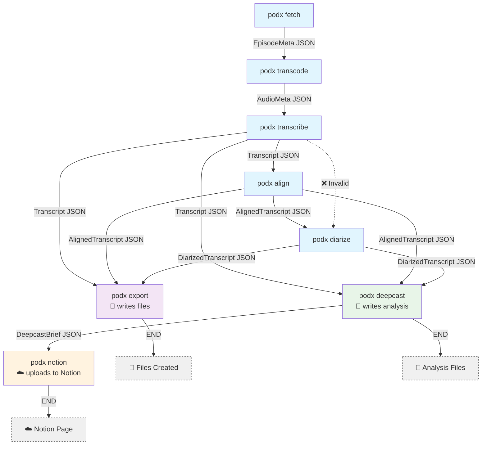

# Podx Pipeline Flow Diagram

## Valid Pipeline Flows

### Core Processing Flows

1. **Full pipeline**: fetch → transcode → transcribe → align → diarize → export
2. **Skip diarization**: fetch → transcode → transcribe → align → export
3. **Skip alignment/diarization**: fetch → transcode → transcribe → export

### AI Analysis Flows

4. **AI analysis**: transcribe → deepcast → notion
5. **AI analysis with alignment**: transcribe → align → deepcast → notion
6. **AI analysis with diarization**: transcribe → align → diarize → deepcast → notion

### Combined Flows

7. **Full pipeline with AI**: fetch → transcode → transcribe → align → diarize → export + deepcast → notion
8. **Export + AI**: transcribe → export + deepcast → notion

### Orchestrator Behavior

The `podx run` orchestrator shows steps as sequential (e.g., `export → deepcast`), but both `export` and `deepcast` actually run from the same transcript JSON source. The sequential display is for clarity, but they don't depend on each other's output.

## Invalid Flows

- ❌ transcribe → diarize (diarization requires aligned timestamps)
- ❌ export → anything (export writes files, no JSON output)
- ❌ deepcast → anything (deepcast writes files, no JSON output)
- ❌ notion → anything (notion uploads to database, no JSON output)
- ❌ Any backwards flow (wrong data types)

## Key Dependencies

- **podx diarize** requires **podx align** (needs word-level timestamps)
- **podx deepcast** can accept any transcript JSON (transcribe, align, or diarize output)
- **podx export** can accept any transcript JSON (transcribe, align, or diarize output)
- **podx notion** requires deepcast output (needs structured analysis)
- **podx fetch** starts the pipeline (no input required)
